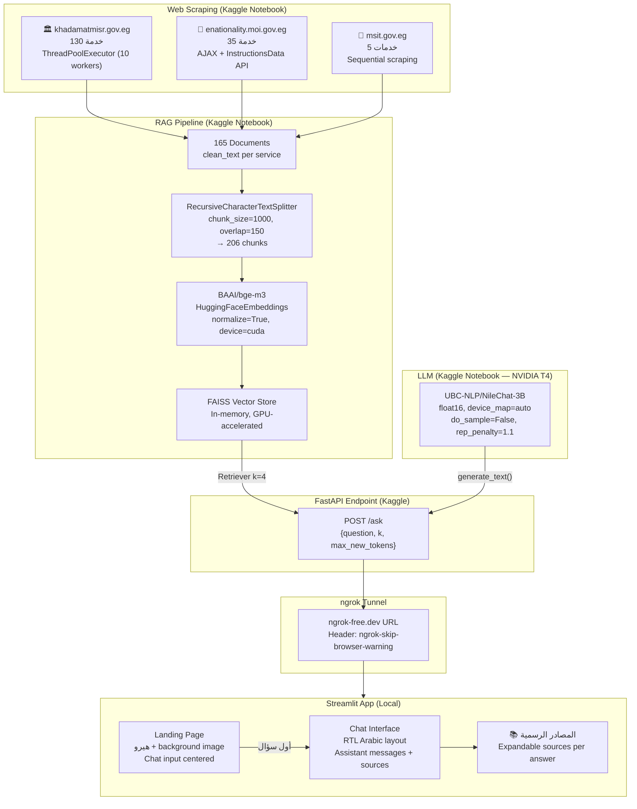

<!-- ══════════════════════════════════════════════════════════════════════════════
     👩‍💼  مدام عفاف | Madam Afaf — README
     AI Citizen Services · RAG · LLM · Web Scraping · Streamlit · Kaggle
     ══════════════════════════════════════════════════════════════════════════════ -->

<div align="center">

<a id="top"></a>

<h1>👩‍💼 مدام عفاف | Madam Afaf</h1>

<a href="https://git.io/typing-svg"></a>

<br/>

<strong>مساعد ذكاء اصطناعي للخدمات الحكومية المصرية</strong><br/>
يجمع بين Web Scraping · RAG · Arabic LLM · Streamlit في منصة واحدة متكاملة

<br/>

<p><sub><b>MODEL & EMBEDDINGS</b></sub></p>
<p>
  
  
  
</p>

<p><sub><b>VECTOR STORE & RAG</b></sub></p>
<p>
  
  
  
</p>

<p><sub><b>DATA & SCRAPING</b></sub></p>
<p>
  
  
  
</p>

<p><sub><b>APPLICATION & DEPLOYMENT</b></sub></p>
<p>
  
  
  
  
</p>

<br/>

<p>
  
  
  
  
  
  
</p>

<br/>

<p>
  <a href="#quick-start"></a>
  <a href="#architecture"></a>
  <a href="#data-sources"></a>
  <a href="#toc"></a>
</p>

<br/>

<blockquote>
<strong>مدام عفاف</strong> هو مساعد ذكاء اصطناعي مجاني لخدمات المواطنين المصريين، يسألك إيه اللي محتاجه وبيجاوبك بالعربي. بيستخدم تقنية RAG عشان يجيب معلومات دقيقة من المواقع الحكومية الرسمية، مع LLM عربي (NileChat-3B) يفهم اللهجة المصرية. النظام بيشتغل على Kaggle كـ backend وStreamlit كـ frontend، ومربوطين ببعض عبر ngrok tunnel.
</blockquote>

</div>

<br/>

---

<a id="toc"></a>

## 📌 Table of Contents

| Section | Section |
|---|---|
| [🎯 Project Overview](#-project-overview) | [🏗 Architecture](#-architecture) |
| [💡 Project Objectives](#-project-objectives) | [⚡ Key Features](#-key-features) |
| [🛠 Technology Stack](#-technology-stack) | [🌐 Data Sources](#-data-sources) |
| [🔄 End-to-End Pipeline](#-end-to-end-pipeline) | [📁 Project Structure](#-project-structure) |
| [✅ Prerequisites](#-prerequisites) | [⚙️ Installation & Setup](#️-installation--setup) |
| [🚀 Running the App](#-running-the-app) | [🎨 UI & Design](#-ui--design) |
| [🧠 Design Decisions](#-design-decisions) | [🔭 Future Improvements](#-future-improvements) |
| [⚡ Quick Start](#-quick-start) | |

---

# 🎯 Project Overview

> **مدام عفاف** هي مساعدة ذكية للخدمات الحكومية المصرية — اسألها بالعربي أو بالعامية المصرية عن أي خدمة حكومية وهترد عليك فورًا بالمعلومات الصح.

المشروع بيتكون من جزأين رئيسيين:

| الجزء | الوصف |
|---|---|
| **Kaggle Notebook** | Backend كامل: Web Scraping لـ 165 خدمة حكومية، بناء FAISS Vector Store، وتشغيل NileChat-3B LLM مع FastAPI endpoint |
| **Streamlit App** | Frontend عربي RTL بتصميم احترافي بيتواصل مع الـ backend عبر ngrok tunnel |

### مصادر الخدمات الحكومية

| المصدر | عدد الخدمات | النوع |
|---|---|---|
| 🏛️ **خدمات مصر** (khadamatmisr.gov.eg) | 130 خدمة | أحوال مدنية، تراخيص، خدمات عامة |
| 🛂 **وزارة الداخلية** (enationality.moi.gov.eg) | 35 خدمة | جوازات، هجرة، جنسية |
| 🍞 **وزارة التموين** (msit.gov.eg) | 5 خدمات | بطاقات تموينية، مخابز |
| **الإجمالي** | **165 وثيقة → 206 chunk** | |

<p align="right"><a href="#top">↑ back to top</a></p>

---

<a id="architecture"></a>

# 🏗 Architecture

### System Architecture — End to End



### Data Flow Summary

```text
gov.eg websites (3 sources)
  ↓  BeautifulSoup4 + ThreadPoolExecutor — Parallel scraping
165 raw documents → clean_text per service
  ↓  RecursiveCharacterTextSplitter (chunk_size=1000, overlap=150)
206 LangChain chunks with metadata {service_name, url, source}
  ↓  BAAI/bge-m3 (HuggingFaceEmbeddings, CUDA, normalize=True)
FAISS Vector Store (in-memory, GPU-accelerated)
  ↓  Retriever (k=4 top chunks per query)
Arabic Prompt Template → NileChat-3B (UBC-NLP, float16)
  ↓  FastAPI /ask endpoint → ngrok tunnel
Streamlit UI (RTL Arabic, landing page → chat interface)
```

<p align="right"><a href="#top">↑ back to top</a></p>

---

# 💡 Project Objectives

| الهدف | التطبيق |
|---|---|
| توفير معلومات حكومية دقيقة باللهجة المصرية | RAG grounded على مصادر رسمية فقط — مفيش hallucination |
| دعم اللهجة العامية المصرية | NileChat-3B مُدرَّب على العربية والعامية |
| Scraping ديناميكي من المواقع الرسمية | BeautifulSoup4 + ThreadPoolExecutor من 3 مواقع حكومية |
| استجابة سريعة مع ذكر المصادر | FAISS retrieval + sources expandable per answer |
| واجهة عربية RTL احترافية | Streamlit مع CSS مخصص للـ RTL والـ dark theme |
| نشر مجاني بدون سيرفر | Kaggle GPU (T4) + ngrok tunnel + Streamlit |

<p align="right"><a href="#top">↑ back to top</a></p>

---

# ⚡ Key Features

### 🤖 RAG & LLM

- **NileChat-3B** — LLM عربي مُدرَّب خصيصًا على العربية والعامية المصرية من UBC-NLP
- **BAAI/bge-m3** — embedding model متعدد اللغات بأداء عالي على العربية
- **FAISS Vector Store** — in-memory similarity search سريع مع GPU acceleration
- **RAG grounded answers** — الإجابات مبنية على context فقط من المواقع الرسمية، مع تعليمات صريحة لعدم إضافة معلومات خارج السياق
- **Source attribution** — كل إجابة بتيجي مع expandable section للمصادر الرسمية

### 🌐 Web Scraping

- **Parallel scraping** — `ThreadPoolExecutor` مع 10 workers لـ khadamatmisr.gov.eg (130 صفحة في ثوانٍ)
- **AJAX API scraping** — وزارة الداخلية بتستخدم `/SearchCategories` و `/InstructionsData` endpoints
- **Smart text cleaning** — إزالة الـ navigation/footer, استخراج المحتوى المفيد فقط
- **Dead-end handling** — تجاهل الصفحات الفارغة أو الـ requests الفاشلة gracefully

### 🎨 UI/UX

- **Landing page** — hero section باللهجة المصرية مع background image وتأثير fade
- **Smooth transition** — الـ hero بيختفي وينزل chat interface بـ CSS animations
- **Full RTL support** — الكل من اليمين لليسار: chat messages, sidebar, inputs
- **Dark theme** — background image مع gradient overlay + yellow accent colors
- **Responsive sidebar** — معلومات عن الخدمات المتاحة ونصايح الاستخدام

### 🔗 Architecture

- **Zero-cost deployment** — Kaggle Free GPU (T4) + ngrok free tier + Streamlit local
- **Session state management** — `pending` flag يمنع double-submission، `fade_hero` للـ animation once
- **Timeout handling** — 300 ثانية timeout مع error messages واضحة باللهجة المصرية

<p align="right"><a href="#top">↑ back to top</a></p>

---

# 🛠 Technology Stack

| Layer | Technology | Purpose |
|---|---|---|
| **LLM** | UBC-NLP/NileChat-3B | Arabic/Egyptian dialect language model |
| **Embeddings** | BAAI/bge-m3 | Multilingual text embeddings (Arabic-optimized) |
| **Vector Store** | FAISS (CPU/GPU) | Similarity search for RAG retrieval |
| **RAG Framework** | LangChain | Document management, chunking, retrieval |
| **Web Scraping** | BeautifulSoup4 + Requests | HTML parsing from gov.eg websites |
| **Concurrency** | ThreadPoolExecutor | Parallel scraping (10 workers) |
| **Deep Learning** | PyTorch + Transformers | LLM inference (float16, device_map=auto) |
| **Backend** | FastAPI (Kaggle Notebook) | `/ask` REST endpoint |
| **Tunnel** | ngrok | Public URL for Kaggle → local Streamlit |
| **Frontend** | Streamlit | Interactive Arabic chat UI |
| **Styling** | Custom CSS (inline) | RTL layout, animations, dark theme |
| **Language** | Python | All components |
| **Compute** | Kaggle (NVIDIA T4 GPU) | Free GPU for LLM inference |

<p align="right"><a href="#top">↑ back to top</a></p>

---

<a id="data-sources"></a>

# 🌐 Data Sources

## 🏛️ خدمات مصر (khadamatmisr.gov.eg)

| Property | Value |
|---|---|
| **URL** | https://www.khadamatmisr.gov.eg/serviceslist |
| **Method** | HTML scraping — `/node/` links |
| **Workers** | 10 parallel threads |
| **Documents** | 130 services |
| **Coverage** | أحوال مدنية، وزارة التربية، الصحة، العدل، وغيرها |

**Text cleaning:** إزالة الـ navigation sections ("عن خدمات مصر"، "كلمة الوزير"، إلخ) + regex whitespace normalization.

## 🛂 وزارة الداخلية — جوازات وهجرة (enationality.moi.gov.eg)

| Property | Value |
|---|---|
| **URL** | https://enationality.moi.gov.eg/UserApplications/Services/Index |
| **Method** | AJAX endpoint (`/SearchCategories` + `/InstructionsData?CategoryId=`) |
| **Documents** | 35 services |
| **Data** | اسم الخدمة، الوصف، المستندات المطلوبة، التوقيت، الرسوم |

**Structured extraction:** كل خدمة بتيجي بـ sections منظمة: إرشادات الطلب / المستندات المطلوبة / التوقيت / الرسوم / رسوم إلكترونية.

## 🍞 وزارة التموين والتجارة الداخلية (msit.gov.eg)

| Property | Value |
|---|---|
| **URLs** | 5 manually selected service pages |
| **Method** | Sequential HTML scraping |
| **Documents** | 5 services (بعض الروابط بترفض connections من Kaggle) |
| **Coverage** | بطاقات تموينية، منافذ تموينية، مخابز |

> **Note:** بعض صفحات MSIT بترفض connections من Kaggle IP — الـ scraping fallback بيـ skip الصفحات دي gracefully.

## Chunking Details

```python
splitter = RecursiveCharacterTextSplitter(
    chunk_size=1000,
    chunk_overlap=150,
    separators=["\n\n", "\n", ". ", " ", ""]
)
# 165 documents → 206 chunks
# كل chunk بيبدأ بـ "اسم الخدمة: <name>" لو مش موجود
```

<p align="right"><a href="#top">↑ back to top</a></p>

---

# 🔄 End-to-End Pipeline

## Step 1 — Web Scraping

**Script:** Cell 6–19 في الـ Kaggle Notebook

الـ notebook بيعمل 3 scrapers بالتوازي:

```python
with ThreadPoolExecutor(max_workers=3) as top:
    f_khadamat = top.submit(scrape_khadamat_all, khadamat_links, 10)
    f_msit     = top.submit(run_parallel, scrape_msit_service, MSIT_SERVICES, 5, "MSIT")
    f_moi      = top.submit(run_parallel, scrape_moi_service, moi_services, 8, "MOI")
```

كل document بيتخزن كـ dict فيه:
- `service_name` — اسم الخدمة
- `url` — رابط المصدر الرسمي
- `clean_text` — النص المنظف للـ embedding
- `source` — اسم الجهة الحكومية
- `category` — "Government Services"

## Step 2 — Chunking & Embedding

```python
# Chunking
chunks = splitter.split_documents(langchain_documents)  # 206 chunks

# Embedding
embedding_model = HuggingFaceEmbeddings(
    model_name="BAAI/bge-m3",
    model_kwargs={"device": "cuda"},
    encode_kwargs={"normalize_embeddings": True}
)

# Vector Store
vectorstore = FAISS.from_documents(chunks, embedding_model)
```

## Step 3 — RAG + LLM Inference

### Prompt Template

```
أنت مساعد لخدمات المواطنين في مصر.

أجب عن سؤال المستخدم اعتمادًا على السياق فقط.

القواعد:
- إذا كان السؤال عن المستندات المطلوبة، اذكر المستندات المطلوبة فقط.
- لا تذكر مراكز أو أماكن تقديم الخدمة.
- لا تضف أي معلومة غير موجودة في السياق.
- حافظ على أسماء المستندات كما وردت في المصدر.
- إذا لم توجد الإجابة في السياق، اكتب: المعلومة غير موجودة في المصادر المتاحة.
- أجب باللهجة المصرية البسيطة.

السياق:
{context}

السؤال:
{question}

الإجابة:
```

### LLM Configuration

```python
model_name = "UBC-NLP/NileChat-3B"

model = AutoModelForCausalLM.from_pretrained(
    model_name,
    torch_dtype=torch.float16,
    device_map="auto"
)

# Inference settings — factual RAG: no randomness
outputs = model.generate(
    **inputs,
    max_new_tokens=300,
    do_sample=False,
    repetition_penalty=1.1,
    pad_token_id=tokenizer.eos_token_id
)
```

## Step 4 — FastAPI + ngrok

الـ notebook بيشغّل FastAPI server على endpoint `/ask`:

```json
// POST /ask
{
  "question": "إزاي أطلّع بطاقة رقم قومي بدل فاقد؟",
  "k": 4,
  "max_new_tokens": 300
}

// Response
{
  "answer": "عشان تطلع بطاقة رقم قومي بدل فاقد...",
  "sources": [
    {
      "service_name": "استخراج بطاقة الرقم القومي",
      "url": "https://www.khadamatmisr.gov.eg/node/...",
      "source": "خدمات مصر"
    }
  ]
}
```

الـ ngrok بيديه public URL زي: `https://stinging-gruffly-progress.ngrok-free.dev`

## Step 5 — Streamlit Frontend

الـ `app.py` بيتواصل مع الـ API:

```python
API_URL = "https://stinging-gruffly-progress.ngrok-free.dev"
HEADERS = {"ngrok-skip-browser-warning": "true"}
RAG_K = 4
MAX_NEW_TOKENS = 300

response = requests.post(
    f"{API_URL}/ask",
    json={"question": question, "k": RAG_K, "max_new_tokens": MAX_NEW_TOKENS},
    headers=HEADERS,
    timeout=300,
)
```

<p align="right"><a href="#top">↑ back to top</a></p>

---

# 📁 Project Structure

```text
Final Project/
│
├── Main Notebook/
│   └── citizen-services-rag-prototype.ipynb   # Kaggle notebook — full backend pipeline
│       ├── ## Libraries                        # pip installs + imports
│       ├── ## LLM Model                        # NileChat-3B load (HuggingFace login)
│       ├── ## Web Scraping                     # 3 scrapers: Khadamat, MOI, MSIT
│       │   ├── ### KHADAMAT MISR               # 130 services, parallel (10 workers)
│       │   ├── ### MINISTRY OF SUPPLY          # 5 services, sequential
│       │   ├── ### PASSPORTS / IMMIGRATION     # 35 services, AJAX API
│       │   └── ### RUN ALL SOURCES             # ThreadPoolExecutor (3 top-level threads)
│       ├── ## Chunking                         # RecursiveCharacterTextSplitter → 206 chunks
│       ├── ## Embedding                        # BAAI/bge-m3, CUDA, normalize=True
│       ├── ## Search                           # FAISS retriever, k=4
│       └── ## Try - Question                   # Prompt template + ask() function + demo
│
├── app.py                                      # Streamlit frontend — Arabic RTL chat UI
│   ├── get_base64_image()                      # Background image as base64
│   ├── CSS (RTL layout, animations, dark theme)
│   ├── render_hero()                           # Landing page hero section
│   ├── show_sources()                          # Expandable official sources
│   └── ask_model()                             # POST /ask to ngrok API
│
├── image.jpg                                   # Background image for the landing page
├── tempCodeRunnerFile.py                       # VS Code temp file (can be ignored)
└── README.md                                   # This file
```

<p align="right"><a href="#top">↑ back to top</a></p>

---

# ✅ Prerequisites

| المتطلب | الوصف |
|---|---|
| **Kaggle Account** | مجاني — للتشغيل على GPU مجاني |
| **HuggingFace Account + Token** | مطلوب لتنزيل NileChat-3B (مجاني) |
| **Python 3.9+** | لتشغيل Streamlit locally |
| **ngrok Account** | مجاني — لعمل tunnel من Kaggle للـ local app |
| **Internet Connection** | لتشغيل الـ scraping ومزامنة الـ models |

### Python Dependencies (Streamlit App)

```bash
streamlit
requests
```

### Kaggle Notebook Dependencies

```bash
langchain langchain-community langchain-core langchain-huggingface langchain-text-splitters
transformers==4.52.4
sentence-transformers faiss-cpu accelerate
requests beautifulsoup4
```

<p align="right"><a href="#top">↑ back to top</a></p>

---

# ⚙️ Installation & Setup

## 1 — Clone the Repository

```bash
git clone https://github.com/<your-username>/madam-afaf.git
cd madam-afaf
```

## 2 — Setup Kaggle Notebook

1. افتح [Kaggle](https://www.kaggle.com) وسجل دخول
2. ارفع `citizen-services-rag-prototype.ipynb` كـ new notebook
3. فعّل **GPU** من Settings → Accelerator → GPU T4 x2
4. فعّل **Internet** من Settings → Internet → On
5. أضف HuggingFace token في Kaggle Secrets باسم `HF_TOKEN`

## 3 — Setup ngrok

1. سجل في [ngrok.com](https://ngrok.com) مجانًا
2. نزّل ngrok وحطه في الـ PATH
3. احصل على authtoken من ngrok dashboard

في آخر الـ Kaggle Notebook، أضف:

```python
from pyngrok import ngrok

ngrok.set_auth_token("YOUR_NGROK_AUTHTOKEN")
public_url = ngrok.connect(8000).public_url
print(f"API URL: {public_url}")

# شغّل FastAPI
uvicorn.run(app, host="0.0.0.0", port=8000)
```

## 4 — Update API URL in app.py

بعد ما الـ notebook يدّيك الـ ngrok URL، حدّثه في `app.py`:

```python
# السطر 242 في app.py
API_URL = "https://YOUR-NGROK-URL.ngrok-free.app"
```

## 5 — Install Streamlit Dependencies

```bash
pip install streamlit requests
```

## 6 — Update Image Path (Optional)

لو عايز تغيّر صورة الـ background، حدّث:

```python
# السطر 21 في app.py
img_path = r"path\to\your\image.jpg"
```

<p align="right"><a href="#top">↑ back to top</a></p>

---

# 🚀 Running the App

## Step 1 — Run the Kaggle Notebook

1. افتح الـ notebook على Kaggle
2. اضغط **Run All** أو شغّل الـ cells بالترتيب
3. الـ notebook هياخد ~10-15 دقيقة:
   - ~3 دقائق لتنزيل NileChat-3B
   - ~10 ثوانٍ للـ web scraping (parallel)
   - ~40 ثانية للـ embeddings (BAAI/bge-m3)
4. هيطلع لك ngrok URL — انسخه

## Step 2 — Run the Streamlit App

```bash
streamlit run app.py
```

افتح http://localhost:8501 في الـ browser.

## Step 3 — Ask Away! 🎉

أمثلة على الأسئلة:
- *"إزاي أطلّع بطاقة رقم قومي بدل فاقد؟"*
- *"ما هي المستندات المطلوبة لاكتساب الجنسية المصرية لأبناء الأم المصرية؟"*
- *"عايز أجدد جواز سفري، هعمل إيه؟"*
- *"إيه متطلبات التقديم على منفذ تموينى؟"*

<p align="right"><a href="#top">↑ back to top</a></p>

---

# 🎨 UI & Design

### Landing Page
- **Hero section** بعنوان "مدام عفاف" وجملة "الموظفة اللي مش هتقولك فوت علينا بكرة! 😉"
- Chat input ينزل لمنتصف الشاشة (`translateY(-35vh)`)
- Background image مع dark overlay (70% opacity)

### Chat Interface
- عند أول سؤال: الـ hero بيـ fade out بـ CSS animation (0.6s)
- الـ background بيتلاشى والشاشة ترجع dark عادية
- الرسائل RTL مع font size 1.3rem وline height 1.8

### Sources Section
- كل رد بيجي مع `📚 المصادر الرسمية` expandable
- روابط مباشرة للمواقع الحكومية

### Sidebar
- معلومات عن مدام عفاف والخدمات المتاحة
- تنبيه إن الأسئلة باللهجة المصرية مقبولة

<p align="right"><a href="#top">↑ back to top</a></p>

---

# 🧠 Design Decisions

### ليه NileChat-3B وليس GPT/Gemini؟

NileChat-3B مُدرَّب خصيصًا على العربية والعامية المصرية من UBC-NLP. الهدف كان LLM يفهم اللهجة المصرية ويرد بيها بشكل طبيعي، بدل ما نستخدم LLM عام ونطلب منه "اكتب باللهجة المصرية". كمان بيشتغل مجانًا على Kaggle GPU.

### ليه FAISS وليس ChromaDB/Pinecone؟

FAISS in-memory أسرع وأسهل في الإعداد على Kaggle. مع 206 chunk بس، الـ in-memory store مناسب تمامًا ومفيش حاجة لـ persistent vector DB.

### ليه `do_sample=False` في الـ LLM؟

المشروع ده RAG للمعلومات الحكومية — المطلوب accuracy مش creativity. تعطيل الـ sampling بيضمن إن الإجابات deterministic وأقل احتمال تنحرف عن الـ context.

### ليه Kaggle كـ Backend؟

- GPU مجاني (T4)
- مفيش احتياج لـ cloud deployment
- NileChat-3B بتاخد ~6GB VRAM — مش هينفع يشتغل locally على أغلب الأجهزة

### ليه `repetition_penalty=1.1`؟

اللغة العربية والعامية المصرية فيها تكرار طبيعي، لكن الـ LLM بيميل لتكرار جمل بالكامل. الـ penalty الخفيف ده بيقلل التكرار من غير ما يأثر على جودة الإجابة.

### ليه ngrok وليس حل تاني؟

Kaggle بيمنع الـ inbound connections مباشرة. ngrok بيعمل tunnel من الـ notebook للـ internet بسهولة، ومجاني للاستخدام الأساسي.

<p align="right"><a href="#top">↑ back to top</a></p>

---

# 🔭 Future Improvements

- **📅 Data freshness:** جدولة الـ scraping تلقائيًا كل فترة عشان يتحدث المعلومات
- **🏛️ More sources:** إضافة مواقع حكومية أكتر (الضرائب، السجل التجاري، وزارة العمل)
- **💾 Persistent vector store:** حفظ FAISS index على disk أو استخدام ChromaDB عشان مش محتاج تعيد الـ embedding كل مرة
- **🔍 Hybrid search:** دمج keyword search مع vector search لنتائج أدق
- **📱 Mobile optimization:** تحسين الـ UI للموبايل
- **🌍 Dialect expansion:** دعم لهجات عربية تانية (خليجي، شامي)
- **📊 Analytics:** tracking للأسئلة الأكتر سؤالًا عشان نحسن التغطية
- **🚀 Production deployment:** نقل الـ backend لـ Hugging Face Spaces أو cloud مع GPU
- **🔄 Streaming responses:** استخدام streaming في الـ API عشان الإجابة تيجي progressively
- **🧪 Evaluation:** بناء test set بأسئلة حكومية وتقييم accuracy الإجابات

<p align="right"><a href="#top">↑ back to top</a></p>

---

<a id="quick-start"></a>

# ⚡ Quick Start

```bash
# 1. Clone the repo
git clone https://github.com/<your-username>/madam-afaf.git
cd madam-afaf

# 2. Install Streamlit dependencies
pip install streamlit requests

# 3. Go to Kaggle and:
#    - Upload citizen-services-rag-prototype.ipynb
#    - Enable GPU T4 + Internet
#    - Add HF_TOKEN to Kaggle Secrets
#    - Run All Cells (~15 minutes)
#    - Copy the ngrok URL from the output

# 4. Update API_URL in app.py (line 242)
#    API_URL = "https://YOUR-NGROK-URL.ngrok-free.app"

# 5. Run the Streamlit app
streamlit run app.py
# Opens at http://localhost:8501

# 6. Ask in Egyptian Arabic! 🎉
#    "إزاي أطلّع بطاقة رقم قومي بدل فاقد؟"
#    "عايز أجدد جواز سفري، هعمل إيه؟"
#    "إيه متطلبات البطاقة التموينية الذكية؟"
```

<p align="right"><a href="#top">↑ back to top</a></p>

---

## 🔁 Complete Data Flow

```text
3 Egyptian Gov Websites
  khadamatmisr.gov.eg (130) + enationality.moi.gov.eg (35) + msit.gov.eg (5)
           ↓
  BeautifulSoup4 + ThreadPoolExecutor (parallel scraping ~10s)
           ↓
165 structured documents {service_name, url, clean_text, source}
           ↓
  RecursiveCharacterTextSplitter (chunk_size=1000, overlap=150)
           ↓
206 LangChain chunks with metadata
           ↓
  BAAI/bge-m3 HuggingFaceEmbeddings (CUDA, normalize=True)
           ↓
FAISS Vector Store (in-memory, GPU-accelerated)
           ↓
  User Question → Retriever (k=4 top chunks)
           ↓
Arabic Prompt Template + Context → NileChat-3B (float16, T4 GPU)
           ↓
  FastAPI /ask endpoint → ngrok public URL
           ↓
Streamlit App (RTL Arabic UI, dark theme, source attribution)
```

---

<div align="center">

## 👩‍💼 مدام عفاف | Madam Afaf

**الموظفة اللي مش هتقولك فوت علينا بكرة! 😉**

Built with NileChat-3B · BAAI/bge-m3 · FAISS · LangChain · BeautifulSoup4 · Streamlit · Kaggle GPU · ngrok

<br/>

<a href="#top">↑ back to top</a>

</div>
